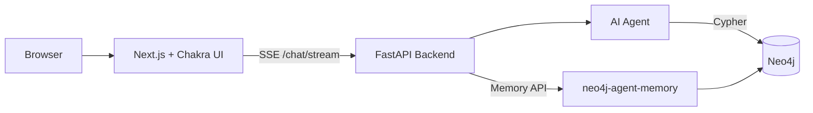

# Generated Project Structure

When you run `create-context-graph`, it produces a complete full-stack application. This page documents every file and directory in the generated output.



## Directory Tree

```
my-app/
├── .env                              # Environment variables (Neo4j, API keys) — gitignored
├── .env.example                      # Configuration template with placeholder values
├── .gitignore                        # Git ignore rules
├── .dockerignore                     # Docker build context exclusions
├── Makefile                          # Build, run, and seed commands
├── docker-compose.yml                # Neo4j container definition (Docker mode only)
├── README.md                         # Auto-generated project documentation
│
├── backend/
│   ├── pyproject.toml                # Python dependencies (includes agent framework)
│   ├── app/
│   │   ├── __init__.py
│   │   ├── main.py                   # FastAPI application entry point
│   │   ├── config.py                 # Settings loaded from .env
│   │   ├── routes.py                 # API endpoints (/chat, /graph, /health)
│   │   ├── models.py                 # Pydantic models generated from ontology
│   │   ├── agent.py                  # AI agent (framework-specific)
│   │   ├── constants.py              # Shared constants (index names, graph projections)
│   │   ├── context_graph_client.py   # Neo4j read/write client with query timeouts
│   │   ├── gds_client.py            # Neo4j Graph Data Science client (label-validated)
│   │   └── vector_client.py         # Vector search client with logging
│   ├── tests/
│   │   ├── __init__.py
│   │   └── test_routes.py            # Generated test scaffold (health, scenarios)
│   └── scripts/
│       └── generate_data.py          # Standalone data generation script
│
├── frontend/
│   ├── package.json                  # Next.js + Chakra UI v3 + NVL dependencies
│   ├── next.config.ts                # Next.js configuration
│   ├── tsconfig.json                 # TypeScript configuration
│   ├── app/
│   │   ├── layout.tsx                # Root layout with Chakra provider
│   │   ├── page.tsx                  # Main page (chat + graph view)
│   │   └── globals.css               # Global styles
│   ├── components/
│   │   ├── ChatInterface.tsx         # Chat UI with streaming responses
│   │   ├── ContextGraphView.tsx      # NVL graph visualization + entity detail panel
│   │   ├── DecisionTracePanel.tsx    # Reasoning trace viewer with step details
│   │   ├── DocumentBrowser.tsx       # Document browser with template filtering
│   │   └── Provider.tsx              # Chakra UI v3 provider wrapper
│   ├── lib/
│   │   └── config.ts                 # Frontend configuration constants
│   └── theme/
│       └── index.ts                  # Chakra UI v3 theme customization
│
├── cypher/
│   ├── schema.cypher                 # Node constraints and indexes from ontology
│   └── gds_projections.cypher        # Graph Data Science projection queries
│
└── data/
    ├── ontology.yaml                 # Copy of the domain ontology
    ├── _base.yaml                    # Copy of the base POLE+O ontology
    ├── fixtures.json                 # Generated demo data (if --demo-data)
    └── documents/                    # Generated synthetic documents
```

<details>
<summary><strong>Backend</strong> — FastAPI + AI agent + Neo4j client</summary>

### `app/main.py`

FastAPI application with CORS middleware, lifespan management for the Neo4j driver, and route mounting. Starts on port 8000.

### `app/config.py`

Pydantic `Settings` class that reads from the `.env` file. Exposes Neo4j connection details, API keys, and framework-specific settings.

### `app/routes.py`

API endpoints:

- `POST /chat` — Send a message to the AI agent (returns `graph_data` from tool call results)
- `POST /chat/stream` — Streaming chat via Server-Sent Events (real-time tool calls + token-by-token text)
- `POST /search` — Search entities in the knowledge graph
- `GET /graph/{entity_name}` — Get the subgraph around an entity
- `GET /schema` — Get the graph database schema (labels and relationship types)
- `GET /schema/visualization` — Get the schema as a graph for visualization (via `db.schema.visualization()`)
- `POST /expand` — Expand a node to show its immediate neighbors (nodes + relationships)
- `POST /cypher` — Execute a Cypher query
- `GET /documents` — List documents with optional template filter
- `GET /documents/{title}` — Get full document content with mentioned entities
- `GET /traces` — List decision traces with full reasoning steps
- `GET /entities/{name}` — Get full entity detail with properties and connections
- `GET /gds/status` — Check GDS availability
- `GET /gds/communities` — Run community detection
- `GET /gds/pagerank` — Run PageRank centrality
- `GET /scenarios` — Get demo scenarios

### `app/models.py`

Pydantic models auto-generated from the ontology's `entity_types`. Each entity label becomes a model class. Enum properties generate Python `Enum` classes.

### `app/agent.py`

The AI agent implementation. This is the only backend file that varies by framework. All framework implementations export the same interface:

```python
async def handle_message(
    message: str,
    session_id: str | None = None,
) -> dict:
    """Returns {"response": str, "session_id": str, "graph_data": dict | None}"""
```

All 8 frameworks also export a streaming variant for the `/chat/stream` SSE endpoint:

```python
async def handle_message_stream(
    message: str,
    session_id: str | None = None,
) -> dict:
    """Streams text deltas and tool events via the CypherResultCollector event queue."""
```

The agent is configured with:
- The domain's `system_prompt` from the ontology
- Domain-specific tools generated from `agent_tools`, each executing Cypher queries against Neo4j
- Session management for conversation continuity

### `app/context_graph_client.py`

Neo4j client for reading and writing to the knowledge graph. Provides methods for entity CRUD, relationship traversal, arbitrary Cypher execution, schema visualization (`db.schema.visualization()`), and node expansion. Uses a custom `_serialize()` function to preserve Neo4j Node/Relationship metadata (labels, elementIds, types) instead of the driver's `.data()` method. Includes a `CypherResultCollector` that captures Cypher results and tool call metadata from agent tool calls for automatic graph data and tool call visualization in the frontend. The collector supports an optional `asyncio.Queue`-based event system for SSE streaming — when a queue is attached, `tool_start`, `tool_end`, `text_delta`, and `done` events are pushed in real-time as agent tools execute. The collector is thread-safe: when called from worker threads (e.g., CrewAI/Strands tools running via `asyncio.to_thread()`), it uses `loop.call_soon_threadsafe()` instead of direct `put_nowait()`.

Also initializes the `neo4j-agent-memory` `MemoryClient` (with graceful fallback if not installed) and exposes `get_conversation_history()` and `store_message()` for multi-turn conversation persistence.

### `app/gds_client.py`

Client for Neo4j Graph Data Science. Includes methods for running graph algorithms (PageRank, community detection, similarity) on projected subgraphs.

### `app/vector_client.py`

Client for Neo4j vector search. Supports storing and querying vector embeddings for semantic search over entities and documents.

### `scripts/generate_data.py`

Data seeding script that loads all fixture data into Neo4j in 4 steps:

1. **Schema** — applies Cypher constraints and indexes
2. **Entities & relationships** — creates domain entity nodes and relationship edges
3. **Documents** — creates `:Document` nodes and links them to mentioned entities via `:MENTIONS` relationships
4. **Decision traces** — creates `:DecisionTrace` → `:HAS_STEP` → `:TraceStep` chains

Run via:
```bash
make seed
# or: cd backend && python scripts/generate_data.py
```


</details>

<details>
<summary><strong>Frontend</strong> — Next.js + Chakra UI v3 + NVL</summary>

### `app/page.tsx`

Main application page with a three-panel layout: chat interface on the left, graph visualization in the center, and a tabbed panel on the right with Decision Traces and Documents tabs. Manages shared state — `graphData` is lifted to the page level and flows from `ChatInterface` (via `onGraphUpdate` callback) to `ContextGraphView` (via `externalGraphData` prop).

### `components/ChatInterface.tsx`

Streaming chat UI component with multi-turn conversation support. Uses Server-Sent Events (SSE) via `POST /chat/stream` for real-time responses: tool calls appear as a Chakra UI Timeline with live Spinner indicators as each tool executes, text tokens stream in and are rendered with ReactMarkdown (batched at ~50ms to avoid excessive re-renders), and graph data flows to the visualization incrementally after each tool completes. Falls back gracefully if the streaming endpoint is unavailable. Manages `session_id` state — captures it from the first SSE event and sends it in all subsequent requests. Chat history is scoped by domain ID to prevent cross-app pollution when running multiple domain apps. Session storage reads are deferred to `useEffect` to avoid SSR hydration mismatches. Includes a "New Conversation" button, clickable demo scenario buttons from the ontology, Collapsible tool detail cards showing inputs/outputs, a retry button on error messages, and an elapsed time counter during loading. Uses Skeleton loading placeholders while waiting for first content. 60s request timeout with AbortController.

### `components/ContextGraphView.tsx`

Interactive NVL (Neo4j Visualization Library) graph component with multiple view modes:

- **Schema view** (initial) — Loads `db.schema.visualization()` showing entity type labels as nodes and relationship types as edges. Double-click a schema node to load instances of that label.
- **Data view** — Displays actual graph data from agent tool calls or manual exploration. Double-click a data node to expand its neighbors (deduplicated merge via `POST /expand`).
- **Interactions** — Drag to move nodes, scroll to zoom, click node/relationship for property details panel (labels, all properties, connections), click canvas to deselect. Back-to-schema button to return to schema view.
- **Agent integration** — Automatically updates when agent tool calls produce graph data (received via `externalGraphData` prop from the parent page).
- **UI overlays** — Color legend (top 6 node types), usage instructions, loading spinner during expansion.

### `components/DecisionTracePanel.tsx`

Displays pre-seeded decision traces loaded from the `/traces` API endpoint. Each trace shows the task, reasoning steps (thought, action, observation), and final outcome. Traces are loaded from `:DecisionTrace` and `:TraceStep` nodes created during `make seed`.

### `components/DocumentBrowser.tsx`

Browsable document panel with template type filter badges (e.g., Discharge Summary, Lab Report, Trade Confirmation). Lists documents with previews, and clicking a document shows full content with mentioned entity badges. Documents are loaded from `:Document` nodes created during `make seed`.

### `components/Provider.tsx`

Chakra UI v3 provider component that wraps the application with the custom theme and color mode configuration.


</details>

<details>
<summary><strong>Cypher</strong> — Schema constraints + GDS projections</summary>

### `schema.cypher`

Auto-generated from the ontology. Contains:
- Uniqueness constraints for properties marked `unique: true`
- Name indexes on every entity type for fast lookups
- Infrastructure indexes for `Document` (title, template_id) and `DecisionTrace` (unique id) nodes

Example output:

```cypher
CREATE CONSTRAINT account_account_id_unique IF NOT EXISTS
FOR (n:Account) REQUIRE n.account_id IS UNIQUE;
CREATE INDEX account_name IF NOT EXISTS
FOR (n:Account) ON (n.name);
```

### `gds_projections.cypher`

Graph Data Science projection queries for running algorithms on domain-specific subgraphs.


</details>

<details>
<summary><strong>Data</strong> — Ontology, fixtures, and documents</summary>

### `ontology.yaml` and `_base.yaml`

Copies of the domain ontology and base POLE+O definitions bundled into the generated project. These serve as documentation and can be used to regenerate schema or data.

### `fixtures.json`

Generated demo data in a structured format:

```json
{
  "entities": {
    "Person": [{"name": "...", ...}],
    "Account": [{"name": "...", ...}]
  },
  "relationships": [
    {"type": "OWNS_ACCOUNT", "source_name": "...", "target_name": "..."}
  ],
  "documents": [
    {"template_id": "...", "title": "...", "content": "..."}
  ],
  "traces": [
    {"task": "...", "steps": [...], "outcome": "..."}
  ]
}
```


</details>

## Configuration Files

### `.env`

```env
NEO4J_URI=neo4j://localhost:7687
NEO4J_USERNAME=neo4j
NEO4J_PASSWORD=password
ANTHROPIC_API_KEY=
```

### `docker-compose.yml`

Defines a Neo4j container with APOC and GDS plugins, mapped to ports 7474 (browser) and 7687 (Bolt).

### `Makefile`

| Target | Description |
|--------|-------------|
| `make install` | Install backend and frontend dependencies |
| `make docker-up` | Start Neo4j via Docker Compose (Docker mode only) |
| `make docker-down` | Stop Neo4j container (Docker mode only) |
| `make neo4j-start` | Start Neo4j via `@johnymontana/neo4j-local` (local mode only) |
| `make neo4j-stop` | Stop neo4j-local (local mode only) |
| `make neo4j-status` | Check neo4j-local status (local mode only) |
| `make seed` | Apply schema and load all fixture data (entities, relationships, documents, traces) into Neo4j |
| `make reset` | Clear all data from Neo4j (`MATCH (n) DETACH DELETE n`) |
| `make test-connection` | Validate Neo4j credentials and connectivity |
| `make start` | Start both backend and frontend (uses `trap` for clean Ctrl+C shutdown) |
| `make dev-backend` | Start only the FastAPI backend |
| `make dev-frontend` | Start only the Next.js frontend |
| `make import` | Re-import data from connected SaaS services (if connectors enabled) |
| `make test` | Run backend and frontend tests |
| `make clean` | Remove generated artifacts |
